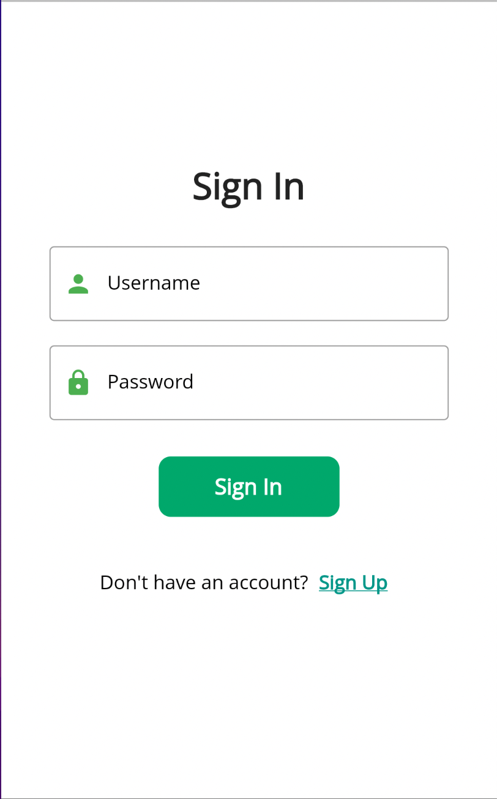
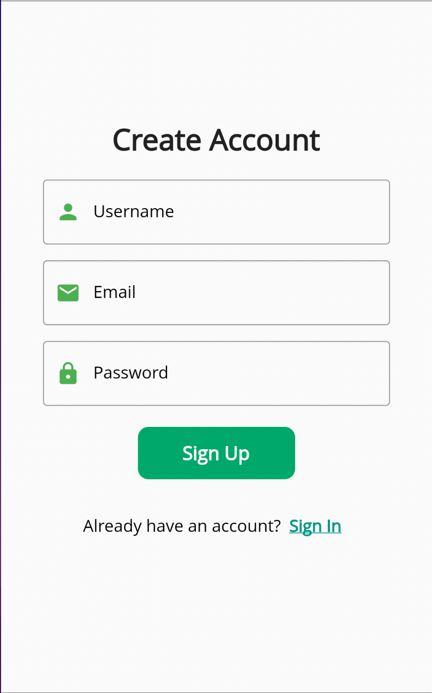
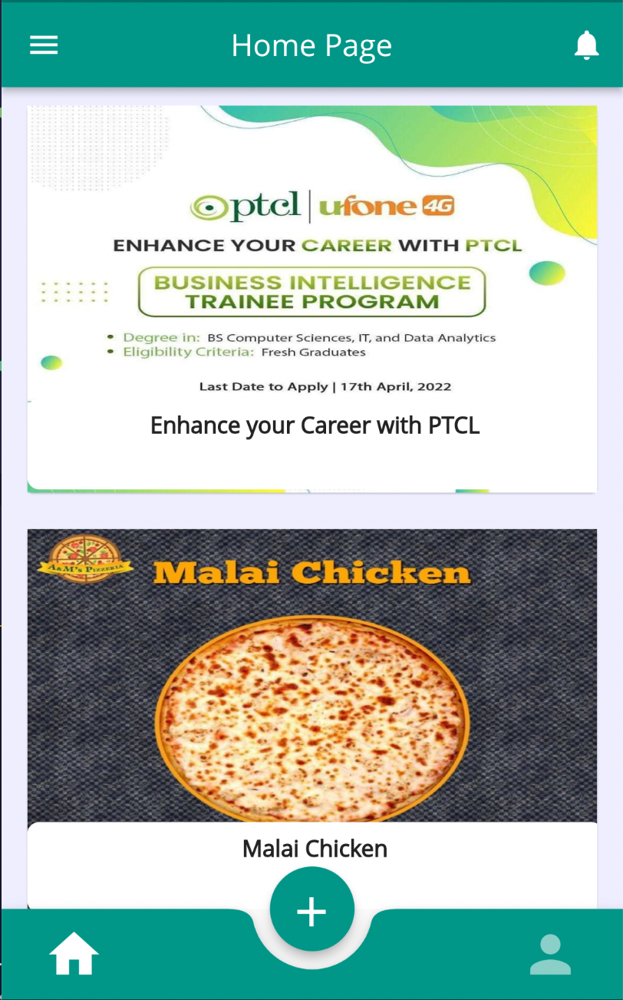
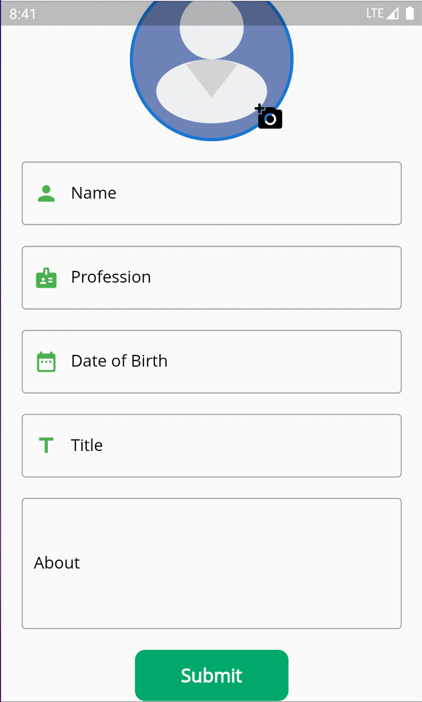
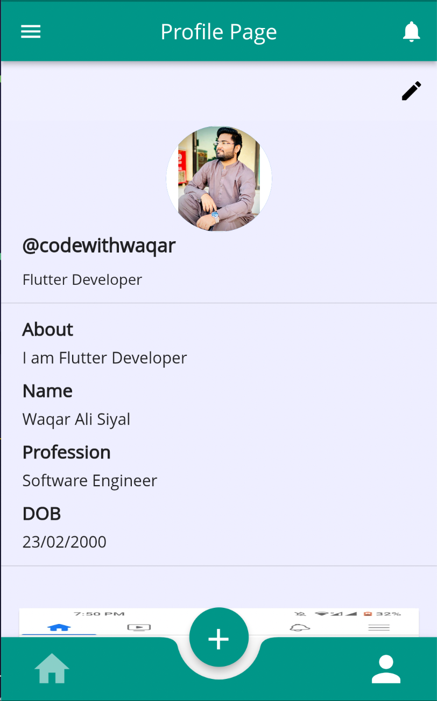
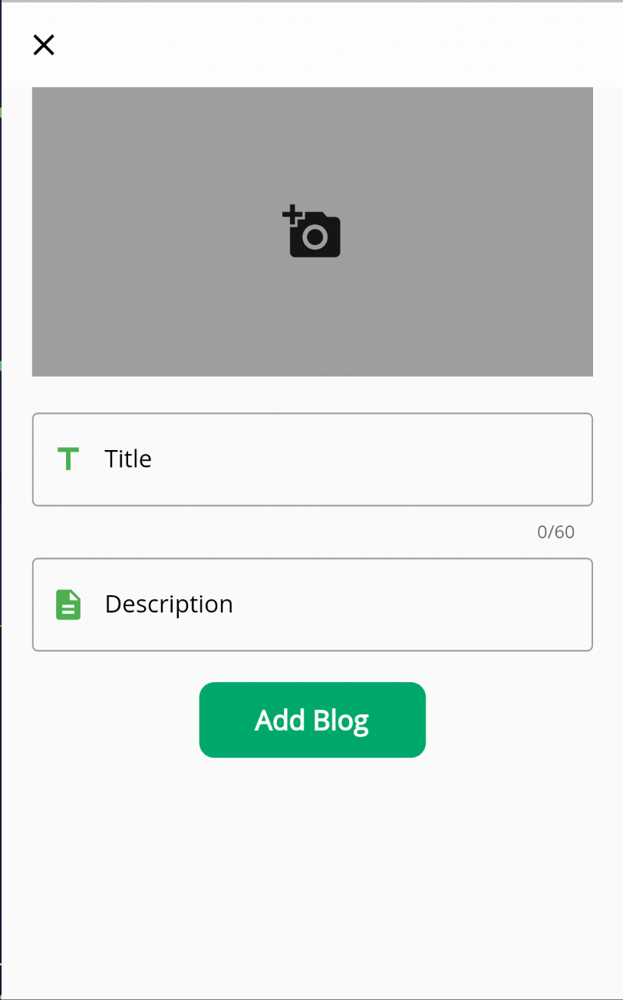

# Flutter Blog App with NodeJS Express MongoDB

This app is developed to learn creating RestAPI and implementing in Flutter App. That's why the UI of this app is very simple and more focus was on creating backend and implementing RestAPI.

## Screenshots of App

## Backend of App

To access the code for creating RestAPI using NodeJS Express and MongoDB, [visit my repository](https://github.com/siraiwaqarali/Blog-Server).
